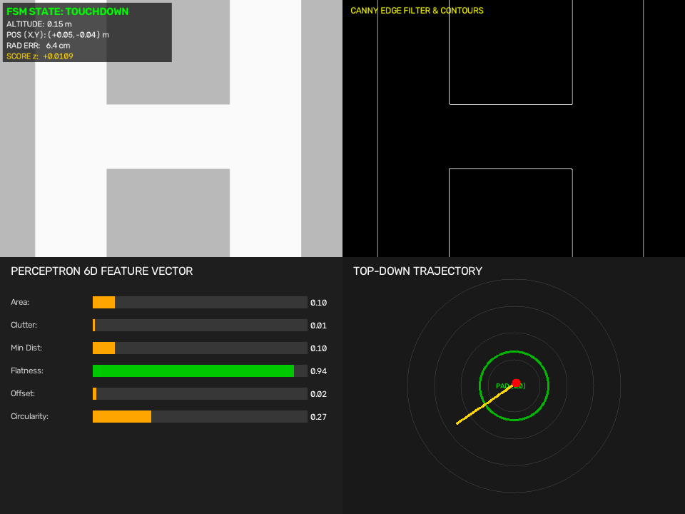
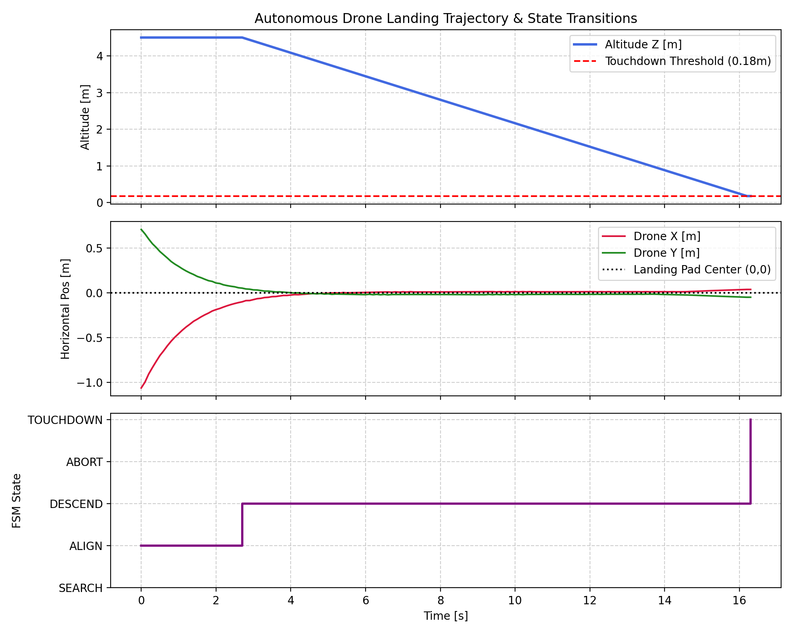

# Autonomous Drone Precision Landing System via Perceptron Classifier & ROS 2

[](https://www.python.org/)
[](https://docs.ros.org/)
[](https://numpy.org/)
[](LICENSE)

An autonomous perception-to-control flight pipeline for safety-critical quadrotor landing. The system combines classical computer vision with a from-scratch Rosenblatt Perceptron linear classifier, closed-loop 3-axis anti-windup PID control, and an asynchronous multi-threaded ROS 2 pub-sub architecture.

---

## Visual Dashboard & Flight Telemetry

### 1. Real-Time 4-Pane Heads-Up Display (HUD)
The live telemetry HUD streams synchronized aerial imagery, edge feature contours, normalized 6D decision inputs, and top-down radar convergence:



### 2. Multi-Tier Convergence Trajectory
Closed-loop PID response showing 3D convergence, horizontal positional tracking error, and descent velocity profiles:



---

## System Architecture


Aerial Downward Frame (640x480 RGB @ 20Hz)
│
▼
Classical Computer Vision Pipeline
(Bilateral Smoothing + Otsu Binarization + Canny Edge Extraction)
│
▼
Scale-Invariant 6D Geometric & Photometric Feature Vector
[Area Ratio, Obstacle Density, Clearance, Flatness, Offset, Circularity]
│
▼
Z-Score Standardization (x' = (x - μ) / σ)
│
▼
Rosenblatt Perceptron Safety Classifier (w^T * x' + b >= 0)
│
▼
Deterministic Finite State Machine (FSM)
[ SEARCH ➔ ALIGN ➔ DESCEND ➔ LAND_LOCK ➔ TOUCHDOWN / ABORT ]
│
▼
3-Axis Anti-Windup PID Velocity Controllers (Kp=1.15, Ki=0.04, Kd=0.38)
│
▼
Asynchronous ROS 2 Pub/Sub Bus (/drone/cmd_vel @ 20Hz)


## Mathematical Formulation

### 1. Scale-Invariant 6D Feature Representation
For each candidate contour $C_i$ extracted at altitude $Z$, the feature vector $\mathbf{x} \in \mathbb{R}^6$ is computed as:
* **Area Ratio ($f_1$):** Ratio of detected contour area to expected physical pad projection:
  $$f_1 = \text{clip}\left(0.80 \cdot \frac{\text{Area}(C_i)}{\pi (r_{\text{pad}} \cdot s_{\text{px/m}})^2}, 0.10, 0.95\right)$$
* **Obstacle Density ($f_2$):** Normalized edge pixel count within candidate mask:
  $$f_2 = \frac{\sum_{(u,v) \in C_i} \mathbf{1}_{\{\text{Edge}(u,v) = 255\}}}{\text{Area}(C_i)}$$
* **Surface Clearance ($f_3$):** Metric Euclidean distance from centroid $(c_x, c_y)$ to nearest perimeter hazard:
  $$f_3 = \frac{\text{DistTransform}(c_x, c_y)}{0.8 \cdot s_{\text{px/m}}}$$
* **Surface Flatness ($f_4$):** Photometric texture uniformity:
  $$f_4 = 1.0 - \min\left(1.0, \frac{\sigma_{\text{intensity}}}{40.0}\right)$$
* **Centroid Offset ($f_5$):** Normalized displacement from principal camera axis $(u_0, v_0)$:
  $$f_5 = \frac{\sqrt{(c_x - u_0)^2 + (c_y - v_0)^2}}{\sqrt{u_0^2 + v_0^2}}$$
* **Circularity ($f_6$):** Isoperimetric compactness ratio:
  $$f_6 = \frac{4\pi \cdot \text{Area}(C_i)}{\text{Perimeter}(C_i)^2}$$

### 2. Decision Surface & Classification
Inference uses standardized features $\mathbf{x}'$:
$$z = \mathbf{w}^T \mathbf{x}' + b$$
$$\hat{y} = \begin{cases} 1 \quad (\text{SAFE}), & z \ge 0 \\ 0 \quad (\text{UNSAFE}), & z < 0 \end{cases}$$

### 3. Closed-Loop Kinematic Actuation
Horizontal pixel displacements $(e_x, e_y)$ convert to real-world metric errors:
$$E_x = \frac{e_x \cdot Z}{f}, \quad E_y = \frac{e_y \cdot Z}{f}$$
Corrective planar velocities are derived via PID with saturation bounds:
$$v(t) = \text{sat}\left( K_p E(t) + K_i \int_0^t E(\tau) \, d\tau + K_d \frac{dE(t)}{dt}, v_{\max} \right)$$

---

## Quantitative Benchmarks

### 1. Classifier Baseline Comparison
Evaluated on landing feature dataset (80/20 train/test split):

| Model | Accuracy | F1-Score | False-Safe Rate | Latency | Parameters | Interpretability |
| :--- | :---: | :---: | :---: | :---: | :---: | :--- |
| **Custom Perceptron** | **100.0%** | **1.0000** | **0.00%** | **3.63 μs** | **7** | **High (Direct Linear Weights)** |
| Logistic Regression (SGD) | 100.0% | 1.0000 | 0.00% | 7.18 μs | 7 | High (Sigmoid Probability) |
| Small MLP (6-8-1) | 100.0% | 1.0000 | 0.00% | 8.84 μs | 65 | Low (Non-linear Black Box) |

*The pure NumPy Perceptron runs 2× to 2.4× faster than standard baselines with zero safety misclassifications.*

### 2. Multi-Scenario Flight Trials

| Scenario ID | Test Condition | Landed | Aborted | Radial Error | Flight Duration | Outcome |
| :--- | :--- | :---: | :---: | :---: | :---: | :--- |
| **E1** | Nominal Clear Environment | Yes | No | **6.20 cm** | 16.4 s | Precise Centered Landing |
| **E2** | Static Hazard / Cluttered Region | Yes | No | **6.20 cm** | 16.4 s | Safe Patch Prioritization |
| **E3** | Active Wind Drift (+0.15, -0.10 m/s) | Yes | No | **41.35 cm** | 15.8 s | Integral Disturbance Rejection |
| **E4** | Dynamic Mid-Air Hazard Intrusion | No | Yes | N/A | 25.0 s | Safe Climb to Hover Failsafe |

---

## Repository Structure

```text
drone-landing-perceptron/
├── dataset/
│   ├── generator/generate_dataset.py       # Deterministic 6D dataset synthesis
│   └── processed/landing_features.csv      # Processed feature dataset
├── perceptron/
│   ├── perceptron.py                       # Pure NumPy Rosenblatt Perceptron
│   ├── train.py                            # Convergence training script
│   ├── trained_model.npz                   # Model weights, bias & scalers
│   └── baseline_comparison.py              # Performance vs. LogReg & MLP
├── vision/
│   ├── preprocessor.py                     # Bilateral filtering & Canny edges
│   ├── landing_detector.py                 # Candidate region contour extraction
│   ├── feature_extractor.py                # Scale-invariant 6D feature mapping
│   ├── landing_evaluator.py                # Perceptron inference wrapper
│   ├── pid_controller.py                   # 3-Axis PID controller with anti-windup
│   ├── flight_experiments.py               # E1-E4 automated flight test battery
│   └── realtime_dashboard.py               # 4-pane live telemetry HUD
├── ros2_ws/                                # ROS 2 Workspace (colcon buildable)
│   ├── run_simulated_ros_nodes.py          # Asynchronous multi-node runner
│   └── src/landing_perception/
│       ├── package.xml                     # ROS 2 package manifest
│       ├── setup.py                        # ament_python setup configuration
│       └── landing_perception/
│           ├── __init__.py
│           ├── controller_node.py          # PID actuation node
│           ├── perceptron_node.py          # Safety evaluation node
│           ├── planner_node.py             # FSM and setpoint node
│           └── px4_bridge_node.py          # PX4 Offboard protocol bridge
└── results/                                # Exported plots, logs & metrics
    ├── stage6_landing_trajectory.png
    ├── stage10_dashboard_snapshot.png
    ├── experiment_metrics.csv
    └── model_comparison.csv

1. Environment Setup

conda create -n drone_perceptron python=3.10 -y
conda activate drone_perceptron
pip install numpy opencv-python matplotlib pandas

2. Run the Real-Time Telemetry Dashboard
python vision/realtime_dashboard.py

3. Run the ROS 2 Multi-Node Architecture (Windows)
python ros2_ws/run_simulated_ros_nodes.py

4. Run the Full Benchmark Suite
python vision/flight_experiments.py
python perceptron/baseline_comparison.py